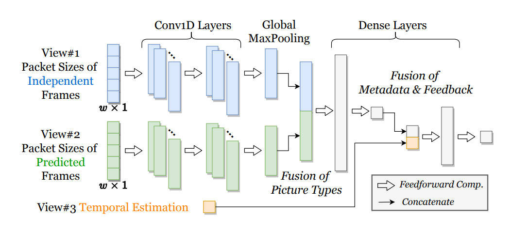

# PacketGame

PacketGame is a pre-decoding packet filter for concurrent video inference at scale.

Our paper "PacketGame: Multi-Stream Packet Gating for Concurrent Video Inference at Scale" is going to appear at *ACM SIGCOMM 2023*.

## Installation

OS: Ubuntu 20.04

### Tensorflow/Mindspore

We implement the neural network-based contextual predictor in PacketGame by Tensorflow 2.4.1 and Mindspore 2.0.0.

Please refer to the installation docs: [Tensorflow](https://www.tensorflow.org/install) / [Mindspore](https://www.mindspore.cn/install)

### FFmpeg with nv-codec

To use FFmpeg with NVIDIA GPU, we need to compile in from source (refers to [NVIDIA doc](https://docs.nvidia.com/video-technologies/video-codec-sdk/11.1/ffmpeg-with-nvidia-gpu/index.html)).

Install ffnvcodec:
```bash
git clone https://git.videolan.org/git/ffmpeg/nv-codec-headers.git
cd nv-codec-headers
make install
```

Install necessary packages:
```bash
apt-get install yasm cmake 
# codecs: h.264, h.265, vp9, jp2k
apt-get install libx264-dev libx265-dev libvpx-dev libopenjp2-7-dev 
```

Download ([v5.1](https://github.com/FFmpeg/FFmpeg/tree/release/5.1)) and install FFmpeg:
```bash
cd FFmpeg-release-5.1/
./configure --enable-nonfree --enable-cuda-nvcc --enable-libnpp --extra-cflags=-I/usr/local/cuda/include --extra-ldflags=-L/usr/local/cuda/lib64 --disable-static --enable-shared --enable-gpl --enable-libx264 --enable-libx265 --enable-libvpx --enable-libopenjpeg
make -j 8
make install
# test
ffmpeg
-------------------------------------------------------------------
ffmpeg version 5.1.2 Copyright (c) 2000-2022 the FFmpeg developers
  built with gcc 9 (Ubuntu 9.4.0-1ubuntu1~20.04.1)
  configuration: --enable-nonfree --enable-cuda-nvcc --enable-libnpp --extra-cflags=-I/usr/local/cuda/include --extra-ldflags=-L/usr/local/cuda/lib64 --disable-static --enable-shared --enable-gpl --enable-libx264 --enable-libx265 --enable-libvpx --enable-libopenjpeg
  libavutil      57. 28.100 / 57. 28.100
  libavcodec     59. 37.100 / 59. 37.100
  libavformat    59. 27.100 / 59. 27.100
  libavdevice    59.  7.100 / 59.  7.100
  libavfilter     8. 44.100 /  8. 44.100
  libswscale      6.  7.100 /  6.  7.100
  libswresample   4.  7.100 /  4.  7.100
  libpostproc    56.  6.100 / 56.  6.100
Hyper fast Audio and Video encoder
usage: ffmpeg [options] [[infile options] -i infile]... {[outfile options] outfile}...
```

## Packet Parser

The first step is to parse the video and save its metadata (packet size and picture type).

```bash
mkdir build
cd build
cmake ..
make
# test
./parser ../test/sample_video.h265 ../test/sampel_video_meta.txt
-----------------------------------------------------------------
251 packets parsed in 0.007604 seconds.
```

## Concurrent Decoding

Platform: 12 Intel Core i7-5930K CPUs / NVIDIA TITAN X GPU

```bash
cd test
# set USEGPU=1
python concurrent_decode.py
----------------------------------------
  concurrency    time cost (s)      fps
-------------  ---------------  -------
            1          1.51226  165.316
            5          3.70409  337.465
           10          6.72792  371.586
           20         13.6818   365.449
           30         19.5902   382.845
           35         18.7045   467.803
           40         23.5301   424.988
           45         25.1256   447.75
           50         27.077    461.646
```

## Contextual Predictor



Implementation using TensorFlow (`src/contextual_tf.py`):
```python
def build_ensemble_threeview(inp_len1=5, inp_len2=5, inp_len3=1, conv_units=[32, 32], dense_unit=128):
    """
    build three-view neural network 

    Args:
        inp_len1, inp_len2, inp_len3 (int): input length of three views, 5 for inp1 & inp2 and 1 for inp3 by default
        conv_units (list of int): number of conv1d units
            by default, two conv1d layers with 32 units
        dense_unit (int): number of dense units, 128 by default
    Return:
        tf.keras.Model instance
    """
    inp1 = layers.Input(shape=(None, inp_len1), name="View1-Indepdendent")
    inp2 = layers.Input(shape=(None, inp_len2), name="View2-Predicted")
    inp3 = layers.Input(shape=(inp_len3), name="View3-Temporal")
    x1 = inp1
    x2 = inp2 
    x3 = inp3
    for u in conv_units:
        x1 = layers.Conv1D(u, 1, activation="relu")(x1)
        x2 = layers.Conv1D(u, 1, activation="relu")(x2)
    x1 = layers.GlobalMaxPooling1D()(x1)
    x2 = layers.GlobalMaxPooling1D()(x2)
    x = layers.Concatenate()([x1, x2])
    out = layers.Dense(1, activation="sigmoid")(x)
    x4 = layers.Concatenate()([out, x3])
    x4 = layers.Dense(dense_unit, activation="relu")(x4)
    out2 = layers.Dense(1, activation='sigmoid')(x4)
    return tf.keras.Model(inputs=[inp1, inp2, inp3], outputs=out2)

m = build_ensemble_threeview(inp_len1=5, inp_len2=5, inp_len3=1, conv_units=[32, 32], dense_unit=128)
print(m.summary())
--------------------------------------------------------------------------------------------------
Model: "model_1"
__________________________________________________________________________________________________
Layer (type)                    Output Shape         Param #     Connected to                     
==================================================================================================
View1-Indepdendent (InputLayer) [(None, None, 5)]    0                                            
__________________________________________________________________________________________________
View2-Predicted (InputLayer)    [(None, None, 5)]    0                                            
__________________________________________________________________________________________________
conv1d_4 (Conv1D)               (None, None, 32)     192         View1-Indepdendent[0][0]         
__________________________________________________________________________________________________
conv1d_5 (Conv1D)               (None, None, 32)     192         View2-Predicted[0][0]            
__________________________________________________________________________________________________
conv1d_6 (Conv1D)               (None, None, 32)     1056        conv1d_4[0][0]                   
__________________________________________________________________________________________________
conv1d_7 (Conv1D)               (None, None, 32)     1056        conv1d_5[0][0]                   
__________________________________________________________________________________________________
global_max_pooling1d_2 (GlobalM (None, 32)           0           conv1d_6[0][0]                   
__________________________________________________________________________________________________
global_max_pooling1d_3 (GlobalM (None, 32)           0           conv1d_7[0][0]                   
__________________________________________________________________________________________________
concatenate_1 (Concatenate)     (None, 64)           0           global_max_pooling1d_2[0][0]     
                                                                 global_max_pooling1d_3[0][0]     
__________________________________________________________________________________________________
dense_1 (Dense)                 (None, 1)            65          concatenate_1[0][0]              
__________________________________________________________________________________________________
View3-Temporal (InputLayer)     [(None, 1)]          0                                            
__________________________________________________________________________________________________
concatenate_2 (Concatenate)     (None, 2)            0           dense_1[0][0]                    
                                                                 View3-Temporal[0][0]             
__________________________________________________________________________________________________
dense_2 (Dense)                 (None, 128)          384         concatenate_2[0][0]              
__________________________________________________________________________________________________
dense_3 (Dense)                 (None, 1)            129         dense_2[0][0]                    
==================================================================================================
Total params: 3,074
Trainable params: 3,074
Non-trainable params: 0
__________________________________________________________________________________________________
```

Implementation using MindSpore (`src/contextual_ms.py`):
```python
class EnsembleThreeview(nn.Cell):
    def __init__(self, inp_len1=5, inp_len2=5, inp_len3=1, conv_units=[32, 32], dense_unit=128):
        super(EnsembleThreeview, self).__init__()
        
        self.view1_layers = nn.CellList([nn.Conv1d(inp_len1, conv_units[0], 1, has_bias=True, pad_mode='valid'),
                                         nn.ReLU()])
        self.view2_layers = nn.CellList([nn.Conv1d(inp_len2, conv_units[0], 1, has_bias=True, pad_mode='valid'),
                                         nn.ReLU()])
        
        for i in range(len(conv_units)-1):
            self.view1_layers.append(nn.Conv1d(conv_units[i], conv_units[i+1], 1, has_bias=True, pad_mode='valid'))
            self.view1_layers.append(nn.ReLU())
            
            self.view2_layers.append(nn.Conv1d(conv_units[i], conv_units[i+1], 1, has_bias=True, pad_mode='valid'))
            self.view2_layers.append(nn.ReLU())
        
        self.view1_layers.append(nn.AdaptiveMaxPool1d(1))
        self.view2_layers.append(nn.AdaptiveMaxPool1d(1))
        
        self.dense = nn.Dense(conv_units[-1]*2, 1, has_bias=True)
        self.sigmoid = nn.Sigmoid()
        
        self.dense2 = nn.Dense(1+inp_len3, dense_unit, has_bias=True)
        self.relu = nn.ReLU()
        self.dense3 = nn.Dense(dense_unit, 1, has_bias=True)

    def construct(self, x1, x2, x3):
        for v1_layer, v2_layer in zip(self.view1_layers, self.view2_layers):
            x1 = v1_layer(x1)
            x2 = v2_layer(x2)
        x = ops.cat((x1, x2), axis=1)
        x = ops.squeeze(x, axis=-1)
        x = self.dense(x)
        x = self.sigmoid(x)
        
        x = ops.cat((x, x3), axis=1)
        x = self.dense2(x)
        x = self.relu(x)
        x = self.dense3(x)
        x = self.sigmoid(x)
        
        return x

net = EnsembleThreeview(inp_len1=5, inp_len2=5, inp_len3=1, conv_units=[32, 32], dense_unit=128)
print(net)
------------------------------------------------------------------------------------
EnsembleThreeview<
  (view1_layers): CellList<
    (0): Conv1d<input_channels=5, output_channels=32, kernel_size=(1, 1), stride=(1, 1), pad_mode=valid, padding=(0, 0, 0, 0), dilation=(1, 1), group=1, has_bias=True, weight_init=normal, bias_init=zeros, format=NCHW>
    (1): ReLU<>
    (2): Conv1d<input_channels=32, output_channels=32, kernel_size=(1, 1), stride=(1, 1), pad_mode=valid, padding=(0, 0, 0, 0), dilation=(1, 1), group=1, has_bias=True, weight_init=normal, bias_init=zeros, format=NCHW>
    (3): ReLU<>
    (4): AdaptiveMaxPool1d<>
    >
  (view2_layers): CellList<
    (0): Conv1d<input_channels=5, output_channels=32, kernel_size=(1, 1), stride=(1, 1), pad_mode=valid, padding=(0, 0, 0, 0), dilation=(1, 1), group=1, has_bias=True, weight_init=normal, bias_init=zeros, format=NCHW>
    (1): ReLU<>
    (2): Conv1d<input_channels=32, output_channels=32, kernel_size=(1, 1), stride=(1, 1), pad_mode=valid, padding=(0, 0, 0, 0), dilation=(1, 1), group=1, has_bias=True, weight_init=normal, bias_init=zeros, format=NCHW>
    (3): ReLU<>
    (4): AdaptiveMaxPool1d<>
    >
  (dense): Dense<input_channels=64, output_channels=1, has_bias=True>
  (sigmoid): Sigmoid<>
  (dense2): Dense<input_channels=2, output_channels=128, has_bias=True>
  (relu): ReLU<>
  (dense3): Dense<input_channels=128, output_channels=1, has_bias=True>
  >

x1 = mindspore.Tensor(np.ones([1, 5, 1]), mindspore.float32)
x2 = mindspore.Tensor(np.ones([1, 5, 1]), mindspore.float32)
x3 = mindspore.Tensor(np.ones([1, 1]), mindspore.float32)
print(net(x1, x2, x3).shape)
------------------------------
(1, 1)

total_params = 0
for v in net.parameters_dict().values():
    print(v, v.size)
    total_params += v.size
print(total_params)
-----------------------
Parameter (name=view1_layers.0.weight, shape=(32, 5, 1, 1), dtype=Float32, requires_grad=True) 160
Parameter (name=view1_layers.0.bias, shape=(32,), dtype=Float32, requires_grad=True) 32
Parameter (name=view1_layers.2.weight, shape=(32, 32, 1, 1), dtype=Float32, requires_grad=True) 1024
Parameter (name=view1_layers.2.bias, shape=(32,), dtype=Float32, requires_grad=True) 32
Parameter (name=view2_layers.0.weight, shape=(32, 5, 1, 1), dtype=Float32, requires_grad=True) 160
Parameter (name=view2_layers.0.bias, shape=(32,), dtype=Float32, requires_grad=True) 32
Parameter (name=view2_layers.2.weight, shape=(32, 32, 1, 1), dtype=Float32, requires_grad=True) 1024
Parameter (name=view2_layers.2.bias, shape=(32,), dtype=Float32, requires_grad=True) 32
Parameter (name=dense.weight, shape=(1, 64), dtype=Float32, requires_grad=True) 64
Parameter (name=dense.bias, shape=(1,), dtype=Float32, requires_grad=True) 1
Parameter (name=dense2.weight, shape=(128, 2), dtype=Float32, requires_grad=True) 256
Parameter (name=dense2.bias, shape=(128,), dtype=Float32, requires_grad=True) 128
Parameter (name=dense3.weight, shape=(1, 128), dtype=Float32, requires_grad=True) 128
Parameter (name=dense3.bias, shape=(1,), dtype=Float32, requires_grad=True) 1
3074
```

## Citation

If you find this repository helpful, please consider citing the following paper:
```
Mu Yuan, Lan Zhang, Xuanke You, and Xiang-Yang Li. 2023. PacketGame: Multi-Stream Packet Gating for Concurrent Video Inference at Scale. In ACM SIGCOMM 2023 Conference (ACM SIGCOMM ’23), September 10–14, 2023, New York, NY, USA. ACM, New York, NY, USA, 14 pages. https://doi.org/10.1145/3603269.3604825
```

## License

PacketGame is licensed under the [MIT License](./LICENSE).